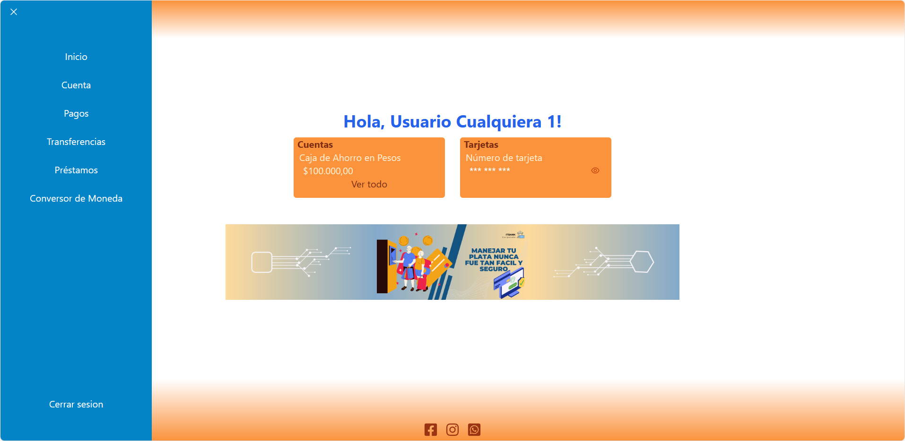

# IT Bank - Sprint N°2
---

## Preview
    

## Descripción del proyecto

Luego del maquetado realizado en el primer sprint, trasladamos todos los componentes a React para obtener una navegación mas fluida y rápida.

## Características

Algunas de las características del proyecto:

### - Inicio de sesión y registro:
   
   

### - Cuentas:
      

###   - Conversor de moneda:
   

###  - Calculadora de préstamos:
   

###  - Transferencias:
   

###  - Pagos:
   

### - Imágenes y texto responsive
 

## Tecnologías con las que se desarrolló el proyecto  

*  HTML
*  CSS
*  JavaScript
*  React

## Código para destacar (Calculadora de préstamos)

```
import React, { useState } from "react";
import { calcularTotal } from "../../utils/prestamos";

const Formulario = ({ cantidad, setCantidad, plazo, setPlazo, setTotal }) => {
  const [error, setError] = useState(false);

  const calcularPrestamo = (e) => {
    e.preventDefault();
    if (cantidad === 0 || plazo === "") {
      setError(true);
      return;
    }
    setError(false);

    const total = calcularTotal(cantidad, plazo);
    setTotal(total);
  };

  return (
    <>
      <form onSubmit={calcularPrestamo} className="flex flex-col items-center">
        <div className="mb-4">
          <label
            htmlFor="montoPrestamo"
            className="block mb-2 text-sm font-medium text-gray-900"
          >
            Ingresar monto del préstamo
          </label>
          <div className="flex">
            <span className="inline-flex items-center px-3 text-md text-gray-900 bg-gray-300 border border-r-0 border-gray-300 rounded-l-md">
              $
            </span>
            <input
              name="montoPrestamo"
              type="number"
              placeholder="Monto del préstamo"
              min="1000"
              required
              className="rounded-none rounded-r-lg bg-gray-50 border border-gray-300 text-gray-900 focus:ring-blue-500 focus:border-blue-500 block flex-1 min-w-0 w-full text-sm p-3"
              onChange={(e) => setCantidad(e.target.value)}
            />
          </div>
        </div>
        <div className="mb-4">
          <label
            htmlFor="cuotasPrestamo"
            className="block mb-2 text-sm font-medium text-gray-900 "
          >
            Plazo para pagar
          </label>
          <div className="flex">
            <select
              defaultValue="Seleccionar cuotas"
              name="cuotasPrestamo"
              className="rounded-none rounded-l-lg bg-gray-50 border border-gray-300 text-gray-900 focus:ring-blue-500 focus:border-blue-500 block flex-1 min-w-0 w-full text-sm p-3"
              onChange={(e) => setPlazo(e.target.value)}
            >
              <option value="3">3</option>
              <option value="6">6</option>
              <option value="9">9</option>
              <option value="12">12</option>
              <option value="18">18</option>
              <option value="24">24</option>
            </select>
            <span className="inline-flex items-center px-3 text-md text-gray-900 bg-gray-300 border border-l-0 border-gray-300 rounded-r-md">
              Meses
            </span>
          </div>
        </div>

        <div>
          <input
            type="submit"
            value="Calcular"
            className="text-white bg-blue-600 hover:bg-blue-700 focus:ring-2 focus:outline-none  font-semibold rounded-md text-sm w-auto px-5 py-2 "
          />
        </div>
      </form>
      {error ? (
        <p className="font-semibold text-md my-2 text-center text-red-500 transition-all">
          Todos los campos son obligatorios...
        </p>
      ) : (
        ""
      )}
    </>
  );
};

export default Formulario;
```


## Recursos utilizados

* Font Awesome
* API ExchangeRate
* Tailwind
* Vite
* React Router

## Integrantes (Grupo 1)

* [Ana Jazmin Vazquez](https://github.com/AJVazquez27)
* [Natalia Anahí Vizcarra Savino](https://github.com/NeitRoot)
* [Juan Cruz Musi](https://github.com/JuanMusi)
* [Jorge Caballero](https://github.com/jorgecaballer0)